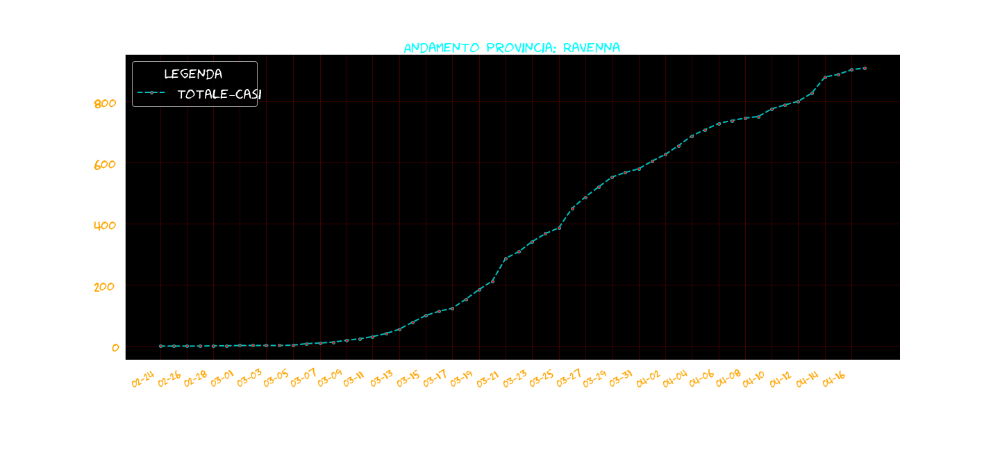

# vision3lab
corso data analysis e visualization 2020
## Header 1
### Header 2
#### Header 3
1. a
2. b
3. c
4. d
* dad
* sda
* dada
* dada
>bfobfoqbf

**CIAO**

```javascript
function fancyAlert(arg) {
  if(arg) {
    $.facebox({div:'#foo'})
  }
}
```


